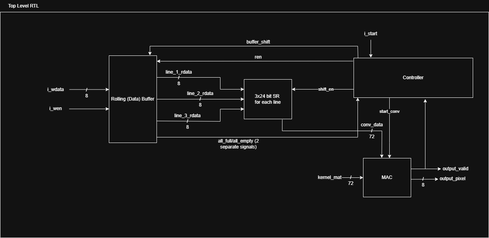
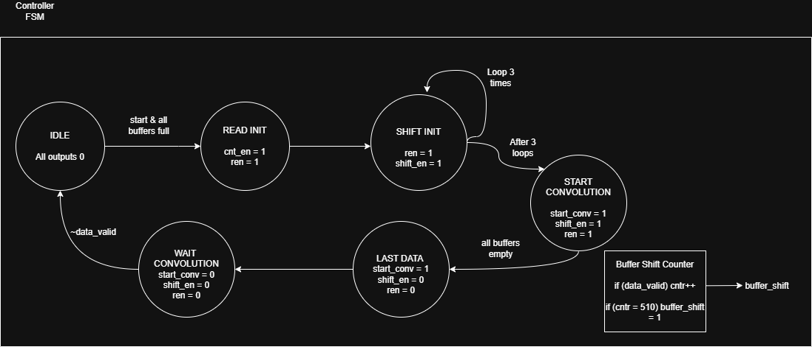
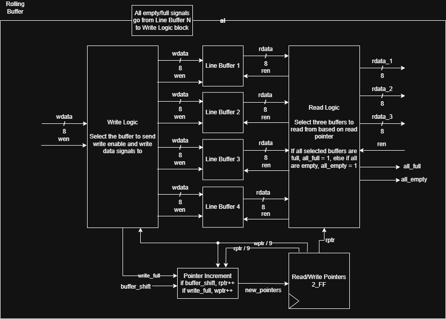
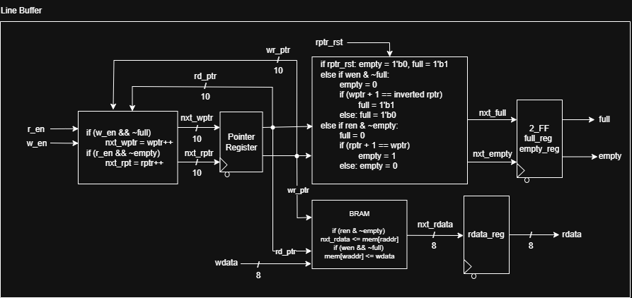
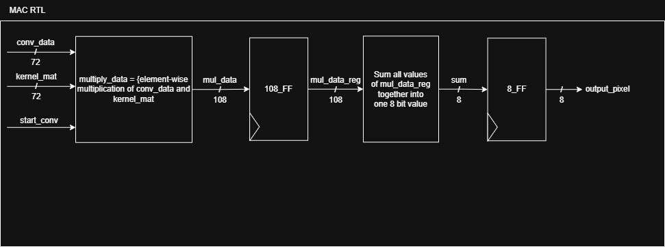
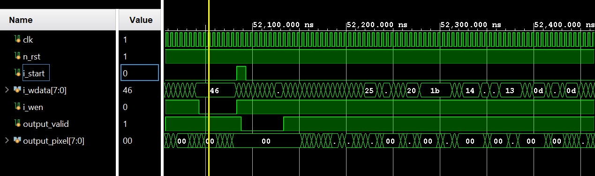

# FPGA_Image_Processor
An FPGA-based Image Processing Unit (Kernel Convolution). Runs at 200 MHz (verified in post-implementation simulation, not on actual hardware... yet)

In simulation, filtered a 512x512 image in about 1,230 microseconds, or 0.001 seconds

Main Purpose: Apply a 3x3 kernel filter to a 512x512 grayscale image

Next Steps: Dynamic filter loading, larger images, RGB images, create user function that manages the input signals given a BMP image (for a microprocessor like Zynq)

## Files: 

The Vivado Project is found in ImageConvolutionUnit/

The files described below are the source files for the image processing unit. As of now, the kernel matrix is hardcoded into the code. 

**top.sv** - Top module to combine the controller, MAC, data buffer, and shift registers

**controller.sv** - The controller is implemented as an FSM with six states. Controls the MAC, shift registers, and reading from the data buffer

**rolling_buffer.sv** - A data buffer consisting of four FIFO's. The default configuration is a size of 512

**line_buffer.sv** - The FIFO implementation

**mac.sv** - The multiply and accumulate to perform element-wise multiplication between the kernel and the data from the shift registers, then adds the elements. Pipelined for better throughput

### Other Files:

Test Scripts - benchmark.c/py were used to compare the runtime of the hardware to software implementations. Obviously, parallelized software on a very fast CPU is likely faster than an FPGA. 

The img_process.py program is used to create the text file that is used in tb_top.sv to testbench the hardware. It takes in a BMP file and outputs a text file. 

The img_create.py program creates the BMP file from the output text file that is created in tb_top.sv. 

Output Folder - Holds the BMP image outputs of img_create.py

## RTL Diagrams: 

Not the best diagrams, but should be enough to understand the basic functioanality. The i_start, i_wen, and i_wdata signals are synchronized with a 2-stage FF synchronizer at the top level to avoid setup/hold violations. 

### Top Level

### Controller

### Rolling Data Buffer

### Line Buffer

### MAC Unit

## Example Waveform

Post implementation simulation waveform

i_start going high activates the MAC and shifting of data from the line buffer into the shift registers. You can see wen high and wdata because a line can be streamed into the line buffers as the convolution takes place. Streaming must be paused after one line, until all 510 pixels of output have been read. 
